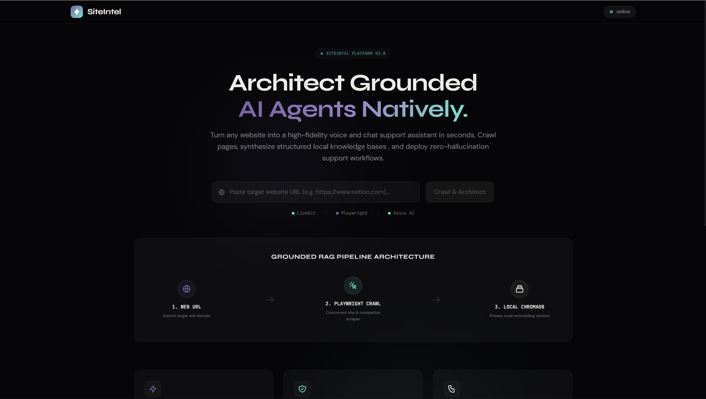
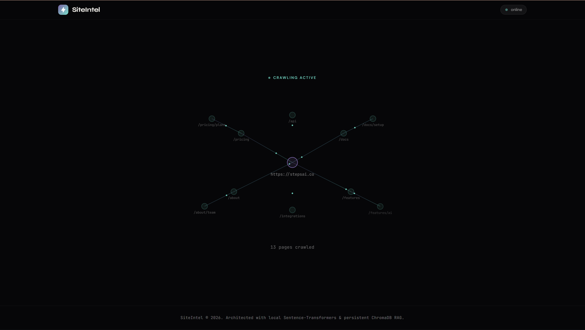
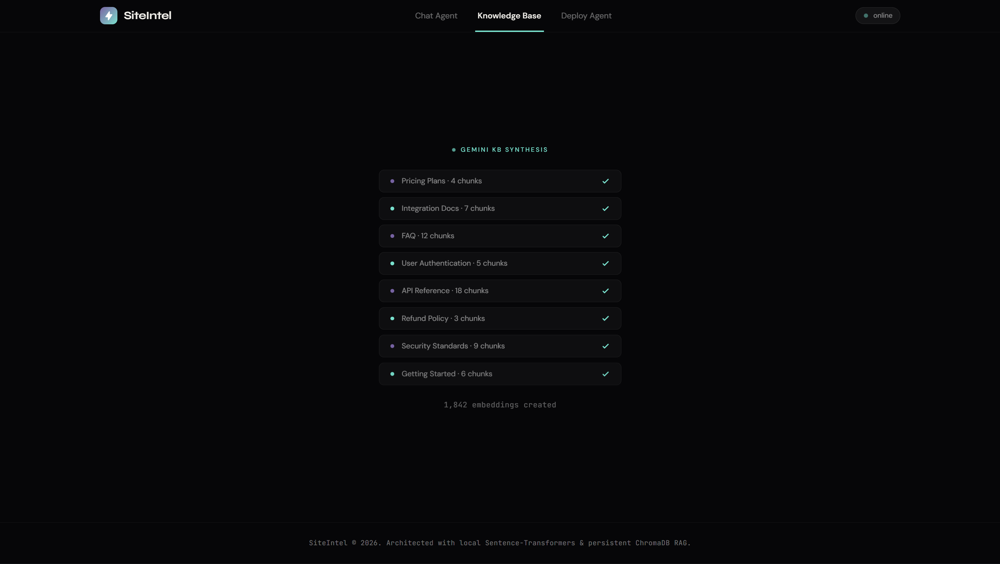
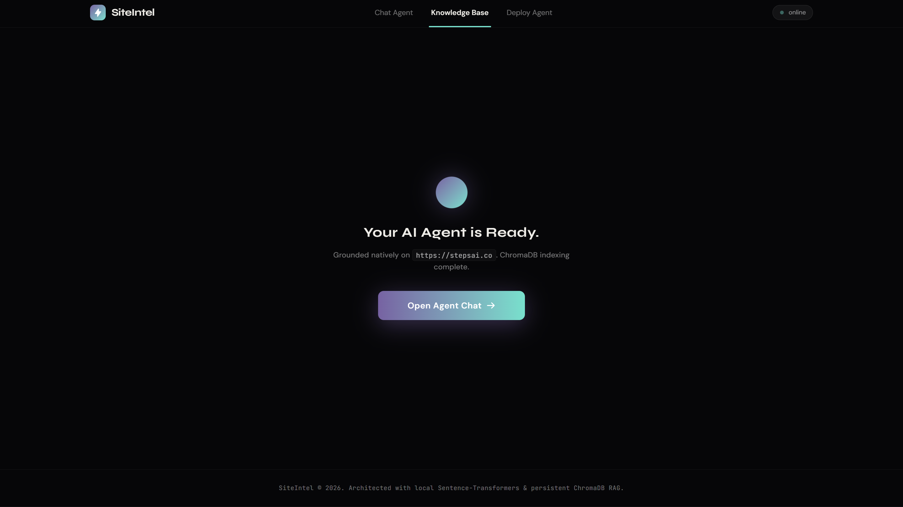
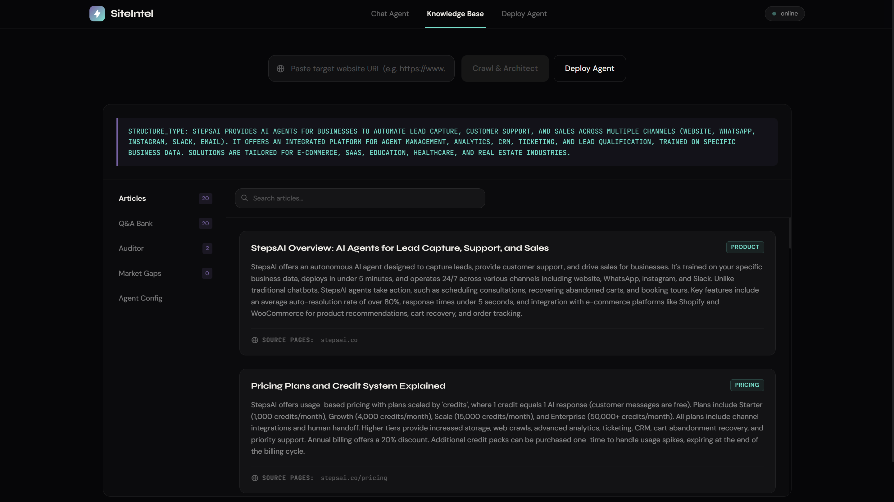
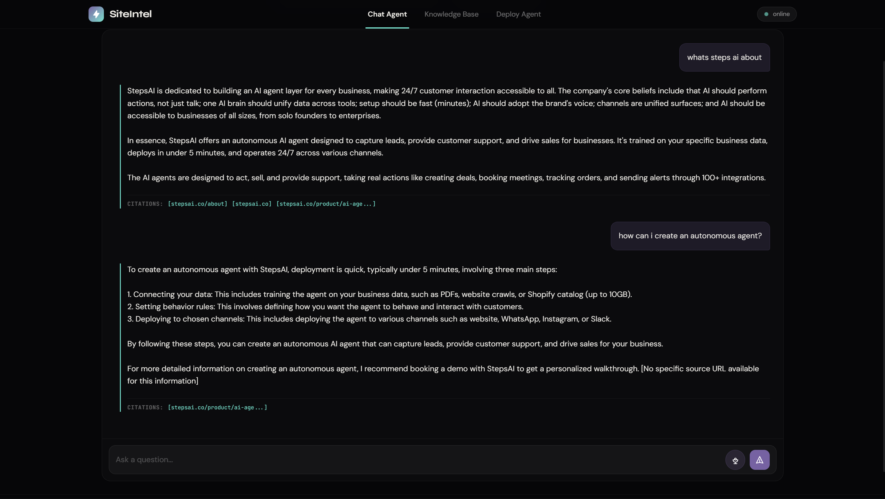
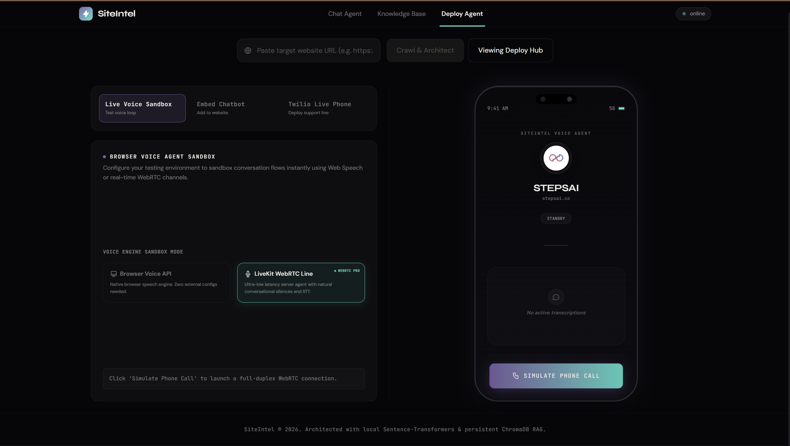
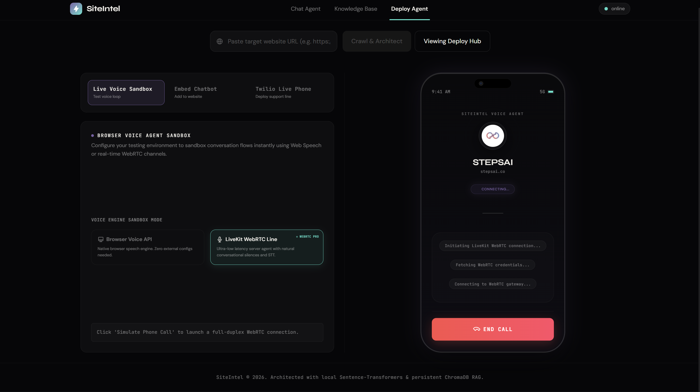

# SiteIntel

**Paste a URL. Get a production-ready AI support agent in under 90 seconds.**

SiteIntel crawls any website, builds a structured knowledge base in a single LLM call, and deploys both a streaming chat agent and a live WebRTC voice agent — all grounded in that site's actual content. No manual Q&A writing. No prompt engineering. No per-page API calls.

---

## Problem Statement

Businesses that want an AI support agent face a painful manual process: copy-paste documentation into prompts, maintain it as the site changes, write Q&A pairs by hand, and still get hallucinated answers. Small teams don't have the time. Developers shouldn't need to rebuild this for every client.

**SiteIntel solves this end-to-end** — crawl → knowledge base → chat + voice agent — with minimal LLM API usage and no human intervention.

---

## Demo

> **[Watch Demo on YouTube / Google Drive](#)** ← *(replace with your link)*

<table>
  <tr>
    <td></td>
    <td></td>
  </tr>
  <tr>
    <td></td>
    <td></td>
  </tr>
  <tr>
    <td></td>
    <td></td>
  </tr>
  <tr>
    <td></td>
    <td></td>
  </tr>
</table>

---

## How It Works

```
User pastes URL
       │
       ▼
┌─────────────────────────────────────────────────────────┐
│  CRAWL  (zero AI cost)                                  │
│  • HTTPX async fetch → Playwright fallback (JS sites)   │
│  • trafilatura extracts clean text                      │
│  • Rule-based classifier: pricing / support / product   │
│  • Priority queue BFS, max 20 pages, 5 concurrent       │
│  • Competitor root pages crawled in parallel            │
└─────────────────────────┬───────────────────────────────┘
                          │  raw pages + competitor pages
                          ▼
┌─────────────────────────────────────────────────────────┐
│  KNOWLEDGE BASE  (1 LLM call)                           │
│  • Entire site batched into single Gemini prompt        │
│  • Returns structured JSON: articles, Q&A, tone,        │
│    competitor gaps, staleness flags                     │
│  • Rule-based auditor checks for contradictions →       │
│    targeted re-crawl + 1 retry call max                 │
│  • Result cached in SQLite (repeat URLs: instant)       │
└─────────────────────────┬───────────────────────────────┘
                          │  structured KB JSON
                          ▼
┌─────────────────────────────────────────────────────────┐
│  RAG INDEX  (zero API cost)                             │
│  • Overlapping 300-word chunks with source metadata     │
│  • Local multilingual-e5-small → 384-dim vectors        │
│  • Stored in embedded ChromaDB, deduplicated by SHA-256 │
└─────────────────────────┬───────────────────────────────┘
                          │
                    ┌─────┴──────┐
                    ▼            ▼
             CHAT AGENT    VOICE AGENT
             (streaming)   (WebRTC)
```

**Total LLM calls to build: 1–2. Total external embedding API calls: 0.**

---

## Architecture

### Voice Pipeline (LiveKit Agents v1.5.x)

```
Browser mic → WebRTC → LiveKit Server
                              │
                              ▼
                    ┌──────────────────┐
                    │  VAD (Silero)    │  150ms silence detection
                    │  STT (Sarvam)    │  saarika, streaming
                    │                  │
                    │  on_user_turn_completed():
                    │    ChromaDB search → inject as system msg
                    │                  │
                    │  LLM (Groq)      │  gpt-oss-120b, ~500ms
                    │  TTS (Sarvam)    │  bulbul:v3, streaming
                    └──────────────────┘
                              │
                        audio stream → browser
```

RAG is injected via the `on_user_turn_completed` hook — not a function tool. This means one LLM call per turn, no raw tool-call syntax ever leaks into TTS audio.

### Chat Pipeline

```
User message → ChromaDB top-5 retrieval → Groq streaming (gpt-oss-120b)
             ← token-by-token SSE stream ←
```

Multi-turn history is bounded to the last 6 messages (3 full turns) to prevent context bloat.

---

## Implementation Approach

The pipeline is deliberately split into three independent phases — crawl, build, index — so each can fail and retry without restarting the others. The crawl phase is entirely synchronous and deterministic (no AI); only the KB build phase touches an LLM. This keeps cost predictable and makes the system testable at each boundary.

The voice agent runs as a separate worker process that connects to LiveKit and waits for dispatch. It shares the same RAG index as the chat agent — there is no separate "voice KB." The same ChromaDB collection answers both interfaces, keeping the system consistent.

### Key Design Decisions

**1. One Gemini call for the entire site, not one per page.**
Gemini 2.5 Flash has a 1M token context window. Rather than looping over pages and making N LLM calls, all crawled content is batched into a single structured prompt. This caps the build cost at 1–2 total LLM calls regardless of site size, which was the primary constraint on free-tier quota.

**2. Local embeddings with no external API.**
`intfloat/multilingual-e5-small` runs locally via `sentence-transformers`, so Hindi and Hinglish questions match English site content. Each model gets its own Chroma collection; after changing `EMBED_MODEL`, run `python reindex.py` to re-embed existing chunks. Every RAG query — both at chat time and inside the voice pipeline — is free and has no network latency. The voice worker loads the model (and ChromaDB) in `prewarm` and keeps an idle process ready, so calls do not pay the ~20s model load.

**3. RAG injected via `on_user_turn_completed`, not a function tool.**
Function tools require the LLM to emit a structured call, which the TTS engine would read aloud verbatim before the actual answer. Using the `on_user_turn_completed` hook instead injects ChromaDB results as a system message before the LLM is invoked — one clean LLM call, nothing leaks into audio.

**4. `preemptive_generation` disabled.**
LiveKit's preemptive generation starts the LLM speculatively before the turn hook runs. When RAG then changes the context, the speculative result is cancelled and a second LLM call is made. Net result: 2 calls instead of 1. Disabling it avoids that waste with no perceptible latency tradeoff.

**5. Rule-based classifier and auditor, not AI.**
Page classification (pricing / support / product / skip) is pure regex against URLs and titles. The quality auditor checks the KB JSON for structural contradictions. Neither touches an LLM. This keeps the two most frequent operations in the pipeline free and fast.

---

## Tech Stack

| Layer | Technology | Why |
|---|---|---|
| Backend API | FastAPI + Uvicorn | Async-native, ideal for streaming responses |
| Crawling | HTTPX + Playwright + trafilatura | JS rendering fallback, clean content extraction |
| KB Builder | Gemini 2.5 Flash (1M ctx) | Entire site fits in one prompt → 1 LLM call |
| RAG Embeddings | sentence-transformers `intfloat/multilingual-e5-small` | Local, zero cost, multilingual (Hindi/Hinglish), 384-dim |
| Vector Store | ChromaDB (embedded) | No external service, file-based persistence |
| Chat LLM | Groq `openai/gpt-oss-120b` (override with `GROQ_MODEL`) | Sub-400ms streaming, separate quota from Gemini |
| Voice Orchestration | LiveKit Agents v1.5.x | WebRTC, VAD, STT/LLM/TTS pipeline |
| STT | Sarvam `saarika:v2.5` streaming | Real-time transcription, Indian English + Indic languages |
| TTS | Sarvam `bulbul:v3` streaming | Same provider and key as STT, natural Indian voices |
| Persistence | SQLite | KB caching, job recovery across restarts |
| Frontend | React + Vite + TypeScript | Lightweight SPA, no SSR overhead |

---

## Features

**Knowledge Base**
- Crawls up to 20 pages with competitor analysis in parallel
- Single Gemini call synthesizes articles, Q&A pairs, system prompt, and audit flags
- Quality auditor triggers targeted re-crawl only when high-severity gaps are found
- SQLite cache — repeat URLs served instantly, no re-crawl

**Chat Agent**
- Streaming responses grounded in crawled content
- Source-cited answers in chat, citation-free in voice mode
- Conversation history per session, bounded for context efficiency
- Falls back gracefully to Gemini if Groq is unavailable

**Voice Agent**
- Browser-native WebRTC (LiveKit) — no phone required
- Sarvam streaming STT → RAG → Groq LLM → Sarvam streaming TTS
- Greeting on connect, warm support agent persona derived from the site's KB
- VAD tuned to 150ms silence detection for snappier turn-taking
- False interruption detection with resume (`min_interruption_words=3`)
- Transcript broadcast over LiveKit data channel — visible in UI in real time

**Infrastructure**
- Job state recovers from SQLite on server restart — active conversations survive
- All RAG operations are local — no external vector API, no per-query cost
- Replies in English to English callers and in Hinglish to Hindi/Hinglish callers (voice switches between `en-IN` and `hi-IN`)

---

## APIs & Models Used

| Service | Usage |
|---|---|
| **Gemini 2.5 Flash** | One-shot KB synthesis (1–2 calls per site) |
| **Groq** (`openai/gpt-oss-120b`) | Streaming chat + voice LLM |
| **Sarvam AI** | Streaming STT + TTS in the LiveKit voice pipeline |
| **Edge-TTS** (local server, optional) | TTS for the browser-native sandbox mode and Twilio line (`/voice/tts`) |
| **LiveKit** | WebRTC signaling, agent dispatch, room management |
| **sentence-transformers** | Local multilingual embeddings (`intfloat/multilingual-e5-small`), zero API cost |

---

## Local Setup

### Prerequisites

- Python 3.10+
- Node.js 18+
- [LiveKit server](https://github.com/livekit/livekit) running locally (Docker recommended)
- A [Sarvam AI](https://dashboard.sarvam.ai) API key — STT + TTS for the LiveKit voice agent
- Optional: [Edge-TTS server](https://github.com/travisvn/openai-edge-tts) on port 5050 — only for the browser-native sandbox mode and Twilio line (falls back to browser/Polly voices if offline)

### 1. Clone & configure

```bash
git clone https://github.com/your-username/siteintel.git
cd siteintel
```

### 2. Backend

```bash
cd backend
pip install -r ../requirements.txt
playwright install chromium
```

Create `backend/.env` (see [Environment Variables](#environment-variables)):

```bash
cp backend/.env.example backend/.env
# fill in your keys
```

Start the API server:

```bash
uvicorn main:app --host 127.0.0.1 --port 8080 --reload
```

### 3. Voice Agent Worker

In a separate terminal:

```bash
cd backend
python agent.py dev
```

The agent worker connects to LiveKit and waits for dispatch. It must be running before a voice call is started.

### 4. LiveKit (Docker)

```bash
docker run --rm \
  -p 7880:7880 -p 7881:7881 -p 7882:7882/udp \
  -e LIVEKIT_KEYS="devkey: secret" \
  livekit/livekit-server --dev
```

### 5. Frontend

```bash
cd frontend
npm install
npm run dev
```

Open `http://localhost:5173`.

---

## Environment Variables

Create `backend/.env` with the following:

```env
# Required — Knowledge Base builder
GEMINI_API_KEY=your_gemini_api_key

# Required — Chat LLM + Voice LLM
GROQ_API_KEY=your_groq_api_key

# Required for voice — Sarvam streaming STT + TTS
SARVAM_API_KEY=your_sarvam_api_key
# Optional — defaults shown
SARVAM_STT_LANGUAGE=unknown  # auto-detect; replies are Hinglish for Hindi callers
SARVAM_SPEAKER=shubh

# LiveKit — use defaults below for local Docker setup
LIVEKIT_URL=ws://localhost:7880
LIVEKIT_API_KEY=devkey
LIVEKIT_API_SECRET=secret

# Optional — local Edge-TTS server (browser-native sandbox mode + Twilio line only)
EDGE_TTS_URL=http://localhost:5050
EDGE_TTS_API_KEY=mykey123
```

**Free tiers that work:**
- Gemini 2.5 Flash — 1M tokens/day free, more than enough (1–2 calls per site)
- Groq — generous free tier, fast
- Sarvam AI — free credits on signup
- LiveKit — self-hosted is free; LiveKit Cloud has a free tier

---

## Project Structure

```
siteintel/
├── backend/
│   ├── main.py                  # FastAPI app, all API routes
│   ├── agent.py                 # LiveKit voice agent worker
│   ├── crawler/
│   │   ├── orchestrator.py      # Priority BFS crawl, competitor discovery
│   │   ├── extractor.py         # HTTPX + Playwright + trafilatura
│   │   └── classifier.py        # Rule-based page type classifier
│   ├── agents/
│   │   ├── kb_architect.py      # Single-shot Gemini KB synthesis
│   │   └── auditor.py           # Rule-based quality checker
│   ├── rag/
│   │   ├── chunker.py           # 300-word overlapping chunker
│   │   ├── embedder.py          # Local sentence-transformers loader
│   │   └── retriever.py         # ChromaDB indexing + similarity search
│   └── store/
│       └── db.py                # SQLite: pages, kb_cache, active_jobs
├── frontend/
│   └── src/
│       ├── App.tsx
│       └── components/
│           └── DeployHub.tsx    # Main UI: chat panel + voice call
└── requirements.txt
```

---

## API Reference

| Method | Endpoint | Description |
|---|---|---|
| `POST` | `/crawl` | Start pipeline for a URL → returns `job_id` |
| `GET` | `/status/{job_id}` | Poll progress (crawling / building_kb / auditing / indexing / ready) |
| `POST` | `/chat` | Streaming RAG chat (SSE plain text) |
| `GET` | `/livekit/token` | Generate room token + dispatch voice agent |
| `GET` | `/voice/tts` | Proxy to local Edge-TTS, returns `audio/mpeg` |
| `GET` | `/voice/status` | Check Edge-TTS availability |
